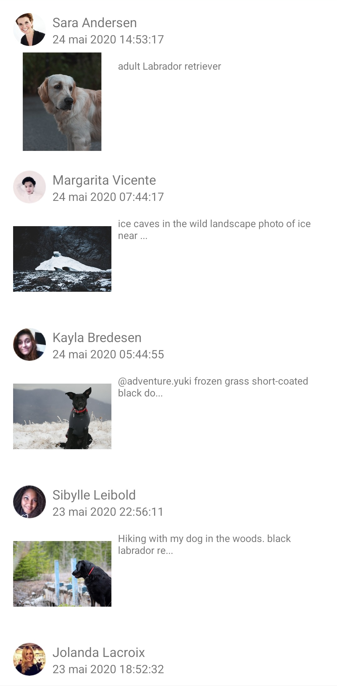
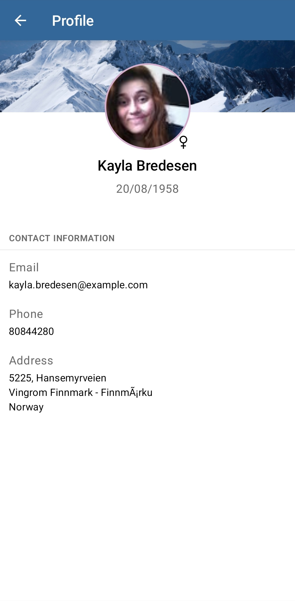

# ChienStagram ?

## Objectifs

L'objectif de cet exercice est d'implémenter de façon incrémentale une application Android qui s'apparente à un Instagram avec des photos de chien.
Ce développement va permettre d'acquérir des bonnes pratiques de code et de découvrir ou de consolider les connaissances en :
- __*Clean Archi*__ : couches presentation, domain et data et injection de dépendance 
- __tests unitaires__ : avec Junit et Mockito
- __gestion des flux de données__ : Coroutine et Flow
- __gestion de la vue__ : vue XML classique et *Jetpack Compose*

## Présentation de l'application

__ChienStagram__ est une application Android donc le front-end qui permet d'afficher une __liste de posts de chien__, c'est-à-dire une photo d'un chien (ou chat) postée par une utilisateur, à une certaine date, avec une description et des tags. Chaque utilisateur peut en outre liker et laisser un commentaire sur un post. 

Dans l'univers de ChienStagram, la RGPD n'existe pas. Chaque utilisateur a un prénom, nom, genre, date de naissance, e-mail, téléphone et adresse physique.

ChienStagram est découpé en 3 écrans principaux :
- L'écran d'accueil : __*home screen*__ qui contient la liste des posts
- L'écran de post : __*post screen*__ qui permet de visualiser l'image en grand et le détail d'un post. Il est accessible au clic sur un post depuis l'écran d'accueil
- L'écran de profil : __*user screen*__ où l'on peut voir les informations de l'utilisateur. Il est accessible par un clic sur n'importe quel avatar sur les deux précédents écrans. 

Voici un exemple d'interface pour l'application. Il est possible de changer les formes, les tailles, les couleurs ou faire apparaîte des informations de différentes manières ou de les masquer :

| home screen | post screen | user screen |
|:-----------:|:-----------:|:-----------:|
|  |  |  |

## Découpage de l'implémentation

L'architecture du projet a été mis en place et le premier écran a été développé. L'objectif est de développer les deux autres écrans en commençant par la couche domain, puis data et enfin présentation.

Avant de commencer les développements il est conseillé de s'impreigner du code (ne pas hésiter à avoir un oeil critique dessus) et de lire ces liens si vous en ressentez le besoin :
- Un Article Medium sur la [Clean Archi Android](https://medium.com/android-dev-hacks/detailed-guide-on-android-clean-architecture-9eab262a9011)
- La doc Android sur les [fondamentaux du testing](https://developer.android.com/training/testing/fundamentals)
- La doc Android sur les [Coroutines](https://developer.android.com/kotlin/coroutines) et les [Flow](https://developer.android.com/kotlin/flow) 

L'application repose sur une API [dummyapi](https://dummyapi.io/docs) et il faut se créer un compte et générer une app-id comme indiqué dans la page __*Getting Started*__. Cette app-id est à mettre dans la classe `DummyApi` du module `:api`.

### Partie 1 : Développement du domaine

Le domaine est le coeur de l'application qui contient la logique et les règles métier. Il est donc important que le domaine soit indépendant des autres modules et d'autres bibliothèques liées à l'UI, à Android, ... Mais aussi que toutes les classes (sauf les modèles) et les méthodes publiques soient testées.
